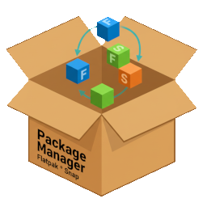
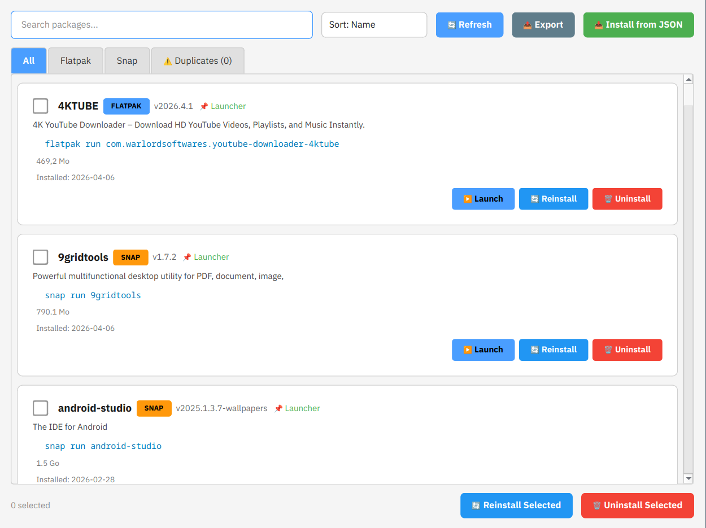

<div align="center">



# Package Manager

**Manage Flatpak & Snap packages with a modern desktop interface**

[](https://github.com/sametkarakus68/pkg-manager/releases/latest)
[](LICENSE)
[](https://github.com/sametkarakus68/pkg-manager/releases)

A PyQt6 desktop application for browsing, launching, installing, and uninstalling **Flatpak** and **Snap** packages on Linux.

</div>

---

## 🖼️ Screenshot



---

## ✨ Features

- 📦 **Browse installed packages** — View all Flatpak and Snap apps with details (version, size, install date)
- ▶️ **Launch apps directly** from the interface
- 🔄 **Reinstall packages** (one or bulk) with progress tracking
- 🗑️ **Uninstall packages** (one or bulk selection)
- ⚠️ **Duplicate detection** — Identifies apps installed both as Flatpak and Snap
- 📤 **Export** package list to JSON for backup
- 📥 **Import from JSON** — Restore packages from a backup file
- 🌙 **Dark/Light theme** — Auto-detects KDE, GNOME, XFCE, Deepin, LXQt
- 🔍 **Search & sort** — Filter by name, sort by name/size/date

---

## 📦 Installation

### Quick Install (recommended)

Works on **all supported distributions**:

```bash
sudo bash -c "$(curl -fsSL https://raw.githubusercontent.com/sametkarakus68/pkg-manager/main/install.sh)"
```

Or download [`install.sh`](install.sh) and run:
```bash
sudo bash install.sh
```

The script auto-detects your distribution and installs the correct package format.

---

### Manual Install by Distribution

#### Debian / Ubuntu / Kubuntu / Linux Mint / Pop!_OS

```bash
sudo apt install ./pkg-manager_1.0.0-1_all.deb
```

Or via Discover: download the `.deb` from [Releases](https://github.com/sametkarakus68/pkg-manager/releases) and open it with Discover.

#### Fedora / RHEL / Nobara

```bash
sudo dnf install ./pkg-manager-1.0.0-1.noarch.rpm
```

#### openSUSE / SLES

```bash
sudo zypper install ./pkg-manager-1.0.0-1.noarch.rpm
```

#### Arch Linux / Manjaro / EndeavourOS

```bash
sudo pacman -U ./pkg-manager-1.0.0-1-any.pkg.tar.zst
```

---

## 📋 Dependencies

| Dependency | Debian/Ubuntu | Fedora | Arch |
|-----------|:-----------:|:------:|:----:|
| **Python 3** | `python3` | `python3` | `python` |
| **PyQt6** | `python3-pyqt6` | `python3-qt6` | `python-pyqt6` |
| **Flatpak** | `flatpak` | `flatpak` | `flatpak` |
| **Snap** | `snapd` | `snapd` | `snapd` |
| **polkit** | bundled | bundled | bundled |

> **Note:** `flatpak` and `snapd` are typically pre-installed on most modern Linux distributions.

---

## 🚀 Usage

```bash
pkg-manager
```

Or launch from your application menu → **Package Manager**.

---

## 🏗️ Build from Source

### Build `.deb` package (Debian/Ubuntu)

```bash
sudo apt install dpkg-dev debhelper
dpkg-buildpackage -us -uc -b
```

### Build `.rpm` package (Fedora/openSUSE)

```bash
sudo dnf install rpm-build
rpmbuild -bb rpm/pkg-manager.spec
```

### Build Arch package

```bash
cd arch
makepkg -si
```

---

## 📁 Project Structure

```
pkg-manager/
├── core.py              # Package management logic
├── ui.py                # PyQt6 GUI components
├── main.py              # Application entry point
├── icon.png             # Application icon
├── pkg-manager.desktop  # Desktop entry file
├── install.sh           # Universal install script
├── debian/              # Debian package build files
├── rpm/                 # RPM spec file
├── arch/                # Arch PKGBUILD
└── screenshots/         # App screenshots
```

---

## 🤝 Contributing

Contributions are welcome! Feel free to:

- Report bugs via [Issues](https://github.com/sametkarakus68/pkg-manager/issues)
- Submit feature requests
- Open pull requests

---

## 📄 License

This project is open source.

---

<p align="center">Made with ❤️ on Kubuntu</p>
